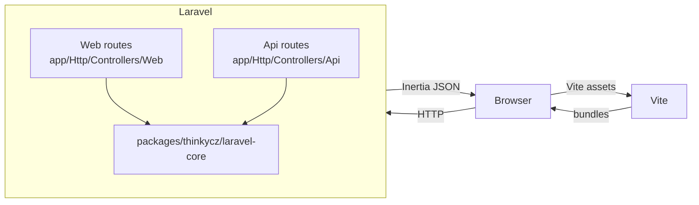
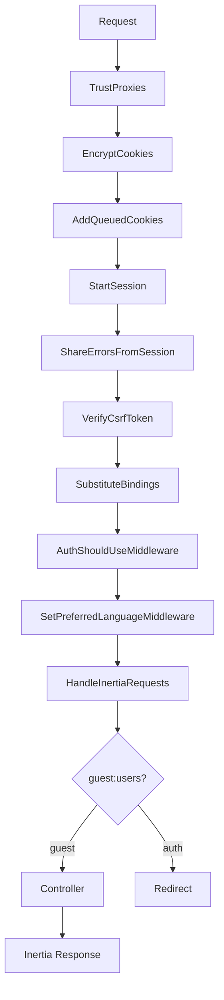
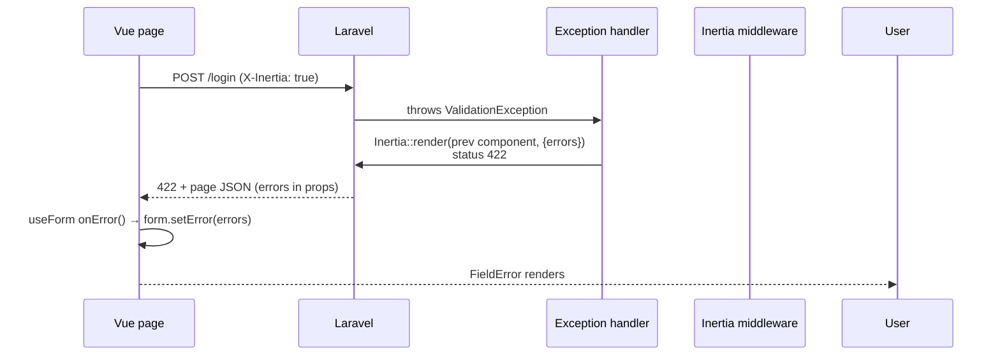
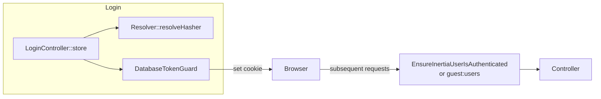

# Architecture

## High-level

This project is a Laravel 13 + Inertia 3 + Vue 3 inventory starter with
**per-user data isolation** within one deployment. Each authenticated user
owns their own stores, item catalog, and stock movements. Quantity is tracked
per store via `store_items`. Users can mark any store as a **warehouse** (`is_warehouse`);
a default Warehouse is auto-created on registration. On the create form, movement
type is **inferred** from source and destination: no source + destination =
incoming (receipt/purchase); source + different destination = outgoing (warehouse
source displays as dispatch, retail source as store transfer). Manual adjustment
is a separate explicit mode (`?mode=adjustment`) that posts `type: adjustment`.
Stock can move between any owned stores; quantity is checked at the source store
for outgoing transfers.

The backend ships with two HTTP surfaces and one framework helper package; the
frontend is a Vite-built Vue 3 app that consumes Inertia pages from the
backend.

### Inventory counts and branch statistics

`/inventory-counts` is a per-store editor focused on data entry. Each
row is one catalog item with three quantity columns: **Aktuální
množství** (read-only — the current on-hand value in `store_items`),
**Poslední množství** (read-only — the value recorded in the previous
inventory session for the same store/item) and **Nové množství** (the
input — what becomes the new on-hand value when the form is saved).
Saving the form creates a new `inventory_sessions` header and one
`inventory_session_items` row per recorded item inside a single
transaction; the matching `store_items` row is upserted so the single
source of truth for "what is on the shelf right now" stays on
`store_items`. Statistical columns (average consumption, days until
restock, status, sparkline, last count) live on the store detail page
instead.

`/inventory-counts/{session}` is the read-only detail of one inventory
session. It lists every item in alphabetical order with the value
recorded in this session and the value from the previous one, so the
operator can compare day-over-day without re-filtering the history.

`/inventory-counts/history` is the audit view: a list of every
`inventory_sessions` header with filters for store, item, and date
range (default window 90 days). Each row links to the matching show
page. The page is accessible to both the main admin and limited users;
limited users are pinned to their assigned store, and visitors without
an `assigned_store_id` are refused (403).

`/reports/statistics` aggregates three data sources for the selected
branch over a configurable window (default 30 days):

- `StatementDay` rows for revenue, channel breakdown, and daily totals.
- `StockMovement` rows for incoming (received) and outgoing (consumed /
  transferred) volume and value.
- `store_items` joined with `items` for the current inventory value.

The store detail page computes per-item average daily consumption from
outgoing movements in the window and predicts when the branch will
run out, so the operator can plan restocking.



## Middleware chain (web)



`AuthShouldUseMiddleware` and `SetPreferredLanguageMiddleware` come from
`packages/thinkycz/laravel-core`. `HandleInertiaRequests` (in
`app/Http/Middleware/`) extends Inertia's base middleware to share `app`,
`auth`, `flash`, and inherited `errors`.

## Validation-error flow (Inertia v3)



Inertia v3 does **not** auto-follow a bare 302 redirect on POST. The handler
in `bootstrap/app.php` therefore re-renders the previous Inertia component
with status 422 and the `errors` prop, so the Vue client merges errors into
the page and populates `useForm().errors`.

## Authentication



- Cookie is HTTP-only and named via the `database_token` config.
- The guard stores `(user_id, token_hash, expires_at)` in the
  `database_tokens` table.
- `LogoutController::destroy` revokes the token row via
  `$user->databaseTokens()->getQuery()->delete()` before invalidating the
  session.

## Frontend layout

```
resources/js/
├── app.ts                  # Inertia app bootstrap
├── bootstrap.ts            # Axios + CSRF setup
├── components/
│   └── ui/                 # FieldError, FlashAlerts, Select, Input, Button
├── composables/
│   └── useSharedProps.ts   # typed accessor for shared props
├── layouts/
│   ├── AppLayout.vue       # authenticated shell
│   └── AuthLayout.vue      # guest shell
├── lib/                    # framework-agnostic helpers
├── pages/                  # Inertia page components
└── types/
    └── index.ts            # AuthUser, AppMeta, FlashProps, SharedProps
```

Pages import shared props via `useSharedProps()` and render them with the
`ui/` primitives. Forms use `@inertiajs/vue3`'s `useForm()` for typed
client-side state; validation errors arrive via page props after the 422
handshake above.

## Local packages

- `packages/thinkycz/laravel-core/` — the framework helper. Provides
  `Resolver`, `Config`, `Env`, `Typer`, `AuthValidity`, `Thrower`, `Parser`,
  `DatabaseToken`, `EmailBrokerService`, `AuthShouldUseMiddleware`,
  `SetPreferredLanguageMiddleware`, and the
  `Illuminate\Contracts\Debug\ExceptionHandler` binding.

App-level code should not re-implement what core already exposes. Use core
helpers before introducing new ones.

## Storage

- Sessions: file driver in dev, configurable in `config/session.php`. E2e
  dev server runs with `SESSION_SECURE_COOKIE=false` and `APP_ENV=testing`.
- Cache: `array` in tests, `file` in dev, `redis` in production
  (per `config/cache.php`).
- Database: MySQL 8 in production; SQLite `:memory:` in tests.

## Runtime services

MySQL 8, Redis, cron, and supervisor are the production runtime services
declared in `composer.json` / `docker-compose.yml` (when present).

## Internationalization (i18n)

The backend (`lang/*.json`) and frontend (`resources/js/i18n/*.json`) translation files are separate but mirrored. This duplication is a deliberate design tradeoff to keep the frontend independent of API calls for localizing core UI shells during bootstrap. In the long term, they can be consolidated by either exposing a backend localization API endpoint or generating the client JSON files from the server JSON files during a build step.

## Role-based access control

There is exactly one **main admin** per deployment, seeded as
`test@test.com` (`is_admin = true`, `parent_user_id = null`). The admin
provisions **limited users** (`is_admin = false`,
`parent_user_id = admin.id`, `assigned_store_id = one-of-admin-stores`)
from the `/users` section.

- Limited users are pinned to one store and only see Dashboard, Výkazy
  (Statements), Inventura, and Settings in `AppLayout.vue`. The store
  select on `/statements` and `/inventory-counts` is fixed; cross-store
  access returns 403.
- All other routes (`/items`, `/stock-movements`, `/stores`, `/reports`,
  `/users`) are wrapped by the `EnsureUserIsAdmin` middleware
  (alias `admin`) which redirects to the dashboard with an Inertia flash
  when the visitor is not the main admin.
- `User::scopeForAdmin(Builder, User $admin)` returns the admin plus
  their subordinate users for listing pages, and
  `User::scopeForAssignedStore(Builder, Store $store)` returns the
  limited user pinned to a given store.
- Limited-user data is scoped to the parent admin: `Statement*` and
  `InventoryCount*` controllers resolve stores, items, and sessions
  through the parent admin, so a limited user only ever sees and writes
  to their assigned store while the admin keeps a single owner of the
  underlying data.

## Inventory history

`inventory_sessions` is the header of one physical count: it records
`user_id` (the admin / parent), `store_id`, `created_by` (the user
who actually entered the values), `counted_at` and a free-form `note`.
Each recorded item lives in `inventory_session_items` with
`(session_id, item_id, quantity, note)`. Sessions are read-only after
creation — the editor and history pages only ever insert new sessions
or upsert `store_items`, never edit past rows.

`/inventory-counts/history` lists every session with store / item /
date-range filters (default window 90 days) and Czech-formatted
timestamps; each row links to the matching show page. The
`/inventory-counts/{session}` show page renders the items in
alphabetical order (catalog order) and exposes the new value and the
previous session's value, so the operator can spot day-over-day
deltas without a join. The store detail page also renders a 30-day
sparkline (`resources/js/components/ui/Sparkline.vue`, pure SVG) for
each item, built from the
`InventorySessionService::sparklineForItem` service call.

`InventorySessionService::createSession`, `::previousQuantity`,
`::buildStoreView` (alphabetical), `::buildSessionView` (alphabetical,
read-only), `::historyForUser`, `::consumptionLastDays`,
`::predictedRunOut`, and `::sparklineForItem` are the single source of
truth for these views.

## Store detail inventory

`/stores/{id}` (`StoreShowController`) is the only place that exposes
the current per-store stock snapshot and its per-item statistics. The
inventory table on that page renders the per-item Množství
(`store_items.quantity`), Hodnota (`quantity × items.purchase_price`),
Stav (`ItemStockStatusEnum::fromQuantity($quantity)` — in_stock /
low_stock / out_of_stock), Vývoj (30 dní)
(`InventorySessionService::sparklineForItem` reading the
`inventory_session_items` history), Naposledy napočítáno (timestamp of
the most recent `inventory_sessions` row that contains the item for
this store), Prům. spotřeba / den (average daily consumption computed
from outgoing movements in the configured window) and Dnů do
vyprodání (predicted days of stock left based on current quantity
and average consumption). The `/items` index never carries these
columns because they belong to the `store_items` link, not the item
catalog.

## Date formatting

All UI dates use the `useCzechDate()` composable
(`resources/js/composables/useCzechDate.ts`) and are rendered in
`dd.MM.yyyy` (or `dd.MM.yyyy HH:mm` for timestamps) regardless of the
active UI locale. The backend always returns ISO 8601 strings; the
frontend formats on the client. `resources/js/lib/format.ts` also uses
`Intl.DateTimeFormat('cs-CZ', …)` so legacy call sites stay consistent.
