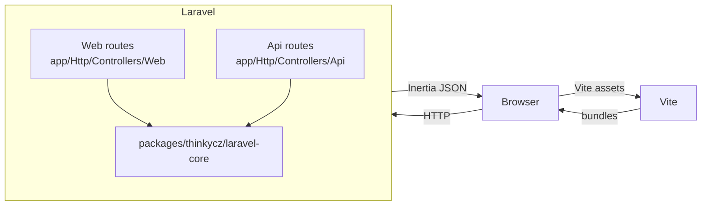
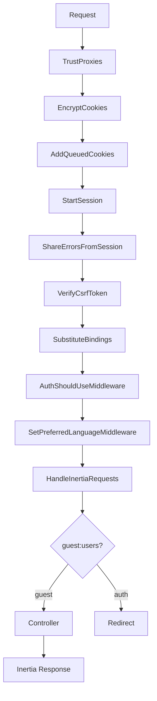
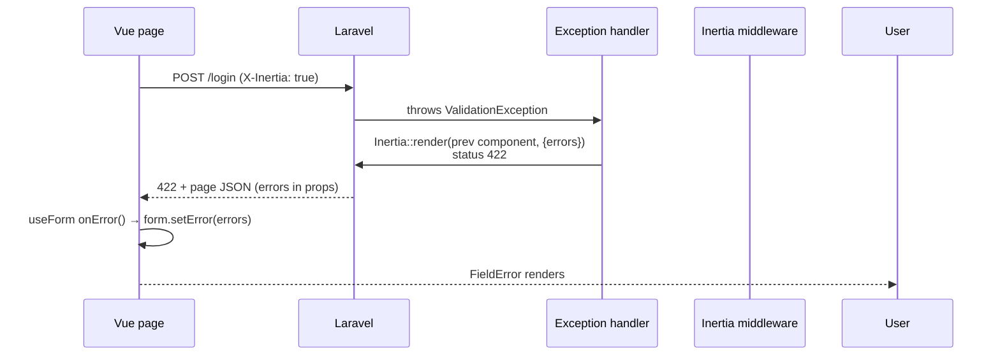
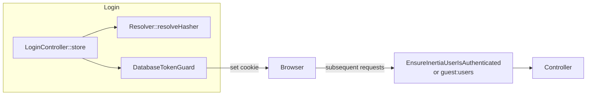

# Architecture

## High-level

This project is a Laravel 13 + Inertia 3 + Vue 3 inventory starter with
**one company per deployment**. The main administrator owns stores, catalog,
and stock movements; limited users resolve that owner and are pinned to an
assigned branch. Quantity is tracked
per store via `store_items`; the immutable stock ledger records `incoming`,
`transfer`, `consumption`, `adjustment`, `inventory_reconciliation`, and
`reversal` events.
A transfer only changes location and never counts as consumption. Physical
inventory creates a snapshot and, for non-zero differences, a linked inventory
reconciliation in the same transaction. See
[`docs/adr/0001-unified-stock-ledger.md`](adr/0001-unified-stock-ledger.md).

The backend ships with two HTTP surfaces and one framework helper package; the
frontend is a Vite-built Vue 3 app that consumes Inertia pages from the
backend.

### Inventory counts and branch statistics

`/inventory-counts` is a per-store editor focused on data entry. Each
row is one catalog item with three quantity columns: **Aktuální
množství** (read-only — the current on-hand value in `store_items`),
**Poslední množství** (read-only — the value recorded in the previous
inventory session for the same store/item) and **Nové množství** (the
input — what becomes the new on-hand value when the form is saved).
Opening the page can resume its store's single active draft. Rows autosave
with a row-specific count time and client version. Closing the draft creates
the final session and reconciliation in one transaction. Every row stores
expected, counted, and difference values. A
non-zero difference creates a linked ledger line with a reason; negative rows
default to consumption and positive rows to inventory correction. The matching
current `store_items` row receives only the difference, preserving movements
posted after that row was counted.

`/inventory-counts/{session}` is the read-only detail of one inventory
session. It lists every item in alphabetical order with the value
recorded in this session and the value from the previous one, so the
operator can compare day-over-day without re-filtering the history.

`/inventory-counts/history` is the audit view: a list of every
`inventory_sessions` header with filters for store, item, and date
range (default window 90 days). Each row links to the matching show
page. The page is accessible to both the main admin and limited users;
limited users are pinned to their assigned store, and visitors without
an `assigned_store_id` are refused (403).

`/reports` is the single admin reporting surface. One active-store and calendar-
month filter drives revenue, channels, fees, actual consumption cost, estimated
gross margin, receipts, transfers, losses/corrections, data coverage, and per-
item stockout forecasts. Closed months reconstruct stock at month end by rolling
back later ledger effects; their value is an estimate using current purchase
prices. Forecasts use only closed physical-count intervals available at the
report cutoff, at most eight and 56 days, and require at least seven covered
days. `/reports/statistics` remains only as a compatibility redirect.


```mermaid
flowchart LR
    Browser -->|HTTP| Laravel
    subgraph Laravel
      Web[Web routes<br/>app/Http/Controllers/Web]
      Api[Api routes<br/>app/Http/Controllers/Api]
      Core[packages/thinkycz/laravel-core]
      Web --> Core
      Api --> Core
    end
    Laravel -->|Inertia JSON| Browser
    Browser -->|Vite assets| Vite
    Vite -->|bundles| Browser
```

## Middleware chain (web)


```mermaid
flowchart TD
    Req[Request] --> TrustProxies
    TrustProxies --> EncryptCookies
    EncryptCookies --> AddQueuedCookies
    AddQueuedCookies --> StartSession
    StartSession --> ShareErrorsFromSession
    ShareErrorsFromSession --> VerifyCsrfToken
    VerifyCsrfToken --> SubstituteBindings
    SubstituteBindings --> AuthShouldUse[AuthShouldUseMiddleware]
    AuthShouldUse --> SetPreferredLanguage[SetPreferredLanguageMiddleware]
    SetPreferredLanguage --> InertiaShare[HandleInertiaRequests]
    InertiaShare --> GuestOrAuth{guest:users?}
    GuestOrAuth -->|guest| Controller
    GuestOrAuth -->|auth| Redirect
    Controller --> Resp[Inertia Response]
```

`AuthShouldUseMiddleware` and `SetPreferredLanguageMiddleware` come from
`packages/thinkycz/laravel-core`. `HandleInertiaRequests` (in
`app/Http/Middleware/`) extends Inertia's base middleware to share `app`,
`auth`, `flash`, and inherited `errors`.

## Validation-error flow (Inertia v3)


```mermaid
sequenceDiagram
    participant FE as Vue page
    participant L as Laravel
    participant H as Exception handler
    participant IM as Inertia middleware

    FE->>L: POST /login (X-Inertia: true)
    L->>H: throws ValidationException
    H->>L: Inertia::render(prev component, {errors})<br/>status 422
    L-->>FE: 422 + page JSON (errors in props)
    FE->>FE: useForm onError() → form.setError(errors)
    FE-->>User: FieldError renders
```

Inertia v3 does **not** auto-follow a bare 302 redirect on POST. The handler
in `bootstrap/app.php` therefore re-renders the previous Inertia component
with status 422 and the `errors` prop, so the Vue client merges errors into
the page and populates `useForm().errors`.

## Authentication


```mermaid
flowchart LR
    subgraph Login
      C[LoginController::store] --> H[Resolver::resolveHasher]
      C --> DT[DatabaseTokenGuard]
    end
    DT -->|set cookie| Browser
    Browser -->|subsequent requests| MW[EnsureInertiaUserIsAuthenticated<br/>or guest:users]
    MW --> Controller
```

- Cookie is HTTP-only and named via the `database_token` config.
- The guard stores `(user_id, token_hash, expires_at)` in the
  `database_tokens` table.
- `LogoutController::destroy` revokes the token row via
  `$user->databaseTokens()->getQuery()->delete()` before invalidating the
  session.

## Frontend layout

```
resources/js/
├── app.ts                  # Inertia app bootstrap
├── bootstrap.ts            # Axios + CSRF setup
├── components/
│   └── ui/                 # FieldError, FlashAlerts, Select, Input, Button
├── composables/
│   └── useSharedProps.ts   # typed accessor for shared props
├── layouts/
│   ├── AppLayout.vue       # authenticated shell
│   └── AuthLayout.vue      # guest shell
├── lib/                    # framework-agnostic helpers
├── pages/                  # Inertia page components
└── types/
    └── index.ts            # AuthUser, AppMeta, FlashProps, SharedProps
```

Pages import shared props via `useSharedProps()` and render them with the
`ui/` primitives. Forms use `@inertiajs/vue3`'s `useForm()` for typed
client-side state; validation errors arrive via page props after the 422
handshake above.

## Local packages

- `packages/thinkycz/laravel-core/` — the framework helper. Provides
  `Resolver`, `Config`, `Env`, `Typer`, `AuthValidity`, `Thrower`, `Parser`,
  `DatabaseToken`, `EmailBrokerService`, `AuthShouldUseMiddleware`,
  `SetPreferredLanguageMiddleware`, and the
  `Illuminate\Contracts\Debug\ExceptionHandler` binding.

App-level code should not re-implement what core already exposes. Use core
helpers before introducing new ones.

## Storage

- Sessions: file driver in dev, configurable in `config/session.php`. E2e
  dev server runs with `SESSION_SECURE_COOKIE=false` and `APP_ENV=testing`.
- Cache: `array` in tests, `file` in dev, `redis` in production
  (per `config/cache.php`).
- Database: MySQL 8 in production; SQLite `:memory:` in tests.

## Runtime services

MySQL 8, Redis, cron, and supervisor are the production runtime services
declared in `composer.json` / `docker-compose.yml` (when present).

## Main-admin AI assistant

The `/assistant` workspace is an admin-only Laravel AI conversation client. It exposes 20 stable resource-level read/write pairs plus `ask_user_choice`. Writers use native human approval and the same application services as human controllers; tools never persist domain models directly.

Readers are deep resource modules rather than a central dispatch switch. Each reader owns closed JSON Schema branches, tenant scopes, direct detail resolution, UI-equivalent filters, and service-backed summaries. Shared read code is restricted to cancellation, version 2 envelopes, encrypted actor/dataset/filter-bound keyset cursors, 50-row and 64 KiB limits, safe errors, and audit metadata. `config/assistant_read_route_parity.php` maps every authenticated GET data route to a reader dataset or a documented exclusion.

Every browser submission is persisted as an `assistant_turn` before provider work and executed once on the dedicated Redis `assistant` queue. Encrypted ordered `assistant_turn_events` provide SSE replay with event IDs and `Last-Event-ID` continuation; a browser disconnect does not cancel generation. Conversation admission is locked atomically, retries create linked child turns, and successful mutations force continuation-only recovery after a later provider failure.

Laravel AI conversation rows remain canonical. The application supplies complete semantic turns under an explicit 300-row/500,000-character budget, verifies exact tool-call/result pairing before provider steps, and rolls older user intent plus audited action outcomes into versioned memory without retaining stale analytical values. A separate 90-day audit ledger is correlated to durable turn IDs. `stockflow:assistant:diagnose` checks provider/model configuration, migrations, Redis locks, queue timeout/heartbeat, and stale turns.

## Internationalization (i18n)

The backend (`lang/*.json`) and frontend (`resources/js/i18n/*.json`) translation files are separate but mirrored. This duplication is a deliberate design tradeoff to keep the frontend independent of API calls for localizing core UI shells during bootstrap. In the long term, they can be consolidated by either exposing a backend localization API endpoint or generating the client JSON files from the server JSON files during a build step.

## Role-based access control

There is exactly one **main admin** per deployment, seeded as
`test@test.com` (`is_admin = true`, `parent_user_id = null`). The admin
provisions **limited users** (`is_admin = false`,
`parent_user_id = admin.id`, `assigned_store_id = one-of-admin-stores`)
from the `/users` section.

### Docházka brigádníků

`/attendance` je provozní docházka aktivní maloobchodní prodejny. Adminský
měsíční výkaz a auditované opravy jsou oddělené na `/attendance/report`, aby
provozní obrazovka zůstala zaměřená pouze na aktuální obsluhu. Pracovní
blok (`attendance_sessions`) začíná příchodem a končí odchodem; libovolný počet
uzavřených pauz ukládá `attendance_breaks`. Unikátní nullable klíče
`active_worker_id` a `active_session_id` databázově brání souběžným otevřeným
blokům jednoho brigádníka a souběžným pauzám jednoho bloku.

Časy jsou UTC timestampy, zatímco párování plánovaných směn, hranice dne a UI
používají `Europe/Prague`. Příchod snapshotuje plán a sazbu odpovídající směny;
report proto zůstává historicky stabilní. Jedinou výjimkou je auditované
schválení odchylky na adminském reportu, které synchronně upraví směnu i její
napárované plánované snapshoty a tím přepočítá otevřenou výplatu. Obsazenost se neukládá duplicitně,
ale odvozuje se ze všech otevřených bloků a pauz prodejny. Neuzavřený blok z
předchozího lokálního dne vytváří stav `unclear` a nevstupuje do odměny.

Adminské doplnění, změna a zneplatnění ukládá důvod a stav před/po změně do
`attendance_audits`. Omezené účty mohou zapisovat běžné události jen pro svou
přiřazenou prodejnu; report, sazby, tisk a opravy jsou admin-only.

`AttendanceRatingService` dávkově odvozuje hodnocení skončených směn z jejich
napárovaných nezneplatněných bloků a pauz. Skóre se neukládá, takže auditovaná
oprava docházky se ihned projeví. Historické směny používají snapshot plánu;
více pracovních bloků se spojí a mezery mezi nimi se počítají jako pauzy.
Brigádník může mít hodnocení administrátorem vypnuté. Služba takové směny
vyřadí ještě před načtením docházkových bloků a vrátí explicitní stav
`disabled` bez bodů a odvozených metrik; samotná evidence docházky, reporty a
mzdy zůstávají beze změny. Opětovné zapnutí obnoví dynamický rating z historie.
`ShiftOverviewService` spojuje rating s naplánovanými hodinami do jediného
`monthly_summary`, který používá přihlášená i veřejná stránka. Adminský řádek
navíc obsahuje `salary`; omezený účet ani veřejný token tento klíč nedostanou.
Veřejný kalendář publikuje pouze stav, skóre a pásmo směny, nikoli konkrétní
důvody nebo časové odchylky. Omezený účet může vytvořit stabilní veřejný token
jen pro svou přiřazenou prodejnu přes `ActiveStoreResolver`.

- Limited users are pinned to one store and only see Dashboard, Výkazy
  (Statements), Inventura, and Settings in `AppLayout.vue`. The store
  select on `/statements` and `/inventory-counts` is fixed; cross-store
  access returns 403.
- All other routes (`/items`, `/stock-movements`, `/stores`, `/reports`,
  `/users`) are wrapped by the `EnsureUserIsAdmin` middleware
  (alias `admin`) which redirects to the dashboard with an Inertia flash
  when the visitor is not the main admin.
- `User::scopeForAdmin(Builder, User $admin)` returns the admin plus
  their subordinate users for listing pages, and
  `User::scopeForAssignedStore(Builder, Store $store)` returns the
  limited user pinned to a given store.
- Limited-user data is scoped to the parent admin: `Statement*` and
  `InventoryCount*` controllers resolve stores, items, and sessions
  through the parent admin, so a limited user only ever sees and writes
  to their assigned store while the admin keeps a single owner of the
  underlying data.

## Dárkové poukazy

Doménu tvoří aktuální firemní branding, neměnné vydané dávky, jednotlivé
poukazy a append-only auditní události. `gift_vouchers.status` drží pouze
`active`, `redeemed` nebo `voided`; `expired` se odvozuje z UTC konce dne
uloženého na dávce a provozní časové zóny `Europe/Prague`.

Kód je kryptograficky náhodný bearer údaj. Šifrovaná podoba umožňuje adminský
dotisk, zatímco unikátní SHA-256 otisk slouží k přesnému vyhledání bez
dešifrování celé kolekce. Lookup nevkládá kód do URL: vytvoří krátkodobý
session ticket svázaný s uživatelem a poukazem. Uplatnění ticket spotřebuje,
zamkne řádek přes `lockForUpdate()` a ve stejné transakci aktualizuje aktuální
stav i auditní událost. Tím databázová transakce, nikoli stav klienta, brání
dvojímu uplatnění.

Vlastníkem dat je hlavní admin. Omezený účet vyhledává přes
`resolveScopeUser()` a může zapisovat pouze na svou `assigned_store_id`;
admin používá aktivní maloobchodní prodejnu. Sklad a cizí firemní scope jsou
odmítnuty. Správa, tisk, zneplatnění a storno uplatnění zůstávají za `admin`
middlewarem.

Brandingové obrázky používají soukromý disk. Vydání kopíruje aktuální logo do
neměnného snapshotu dávky, takže pozdější nastavení nezmění historický dotisk.
Tiskový Inertia controller generuje SVG QR na serveru a stránka skládá explicitní
A4 archy po třech kusech.

## Virtuální nástěnka

Dashboard obsahuje nad provozními přehledy store-scoped virtuální nástěnku.
`noticeboard_cards.user_id` drží firemního vlastníka, `store_id` určuje
publikum a `created_by_user_id` / `updated_by_user_id` zachovávají atribuci.
Admin i omezený uživatel mohou upravit nebo soft-delete libovolnou kartičku
své aktuální či přiřazené prodejny; koš, obnova a definitivní odstranění jsou
admin-only.

Rich-text se před uložením sanitizuje explicitním serverovým whitelistem a
pro hledání se ukládá samostatný čistý text. `lock_version` zabraňuje
přepsání souběžné změny. Volitelná expirace pouze přesouvá kartu do filtru
Expirované a není totožná se smazáním. Privátní obrázek se vydává přes
autorizovaný store-scoped endpoint. Soft-deleted záznamy starší 30 dní
odstraňuje denní příkaz `stockflow:prune-noticeboard-cards`.

Nástěnka je vizuálně plochá část dashboardu bez vnořených panelů; pastelové
karty používají stejné zaoblení, border a stín jako ostatní systémové karty.
Admin dashboard ponechává pouze kompaktní provozní metriky a poslední pohyby.
Detailní finanční tok, skladový rozpad a spotřební analytika patří na
jednotnou stránku `/reports`.

Navigační položka Nástěnka je první v sekci Prodejna. Sdílený helper
`sidebar-navigation.ts` definuje jak pořadí položek této sekce, tak klasifikaci
store-scoped URL. `AppLayout.vue` používá tutéž klasifikaci k centrálnímu
zobrazení informačního pillu aktivní prodejny na Nástěnce, výkazech,
inventurách, reportech, směnách a docházce. U omezeného uživatele
zahrnuje také formuláře příjmu a výdeje; adminské stránky Správy zůstávají bez
pillu.

## Inventory history

`inventory_sessions` is the header of one physical count: it records
`user_id` (the admin / parent), `store_id`, `created_by` (the user
who actually entered the values), `counted_at` and a free-form `note`.
Each recorded item lives in `inventory_session_items` with
`(session_id, item_id, quantity, note)`. Sessions are read-only after
creation — the editor and history pages only ever insert new sessions
or upsert `store_items`, never edit past rows.

`/inventory-counts/history` lists every session with store / item /
date-range filters (default window 90 days) and Czech-formatted
timestamps; each row links to the matching show page. The
`/inventory-counts/{session}` show page renders the items in
alphabetical order (catalog order) and exposes the new value and the
previous session's value, so the operator can spot day-over-day
deltas without a join. The store detail page also renders a 30-day
sparkline (`resources/js/components/ui/Sparkline.vue`, pure SVG) for
each item, built from the
`InventorySessionService::sparklineForItem` service call.

`InventorySessionService::createSession`, `::previousQuantity`,
`::buildStoreView` (alphabetical), `::buildSessionView` (alphabetical,
read-only), `::historyForUser`, `::consumptionLastDays`,
`::predictedRunOut`, and `::sparklineForItem` are the single source of
truth for these views.

## Store detail inventory

`/stores/{id}` (`StoreShowController`) is the only place that exposes
the current per-store stock snapshot and its per-item statistics. The
inventory table on that page renders the per-item Množství
(`store_items.quantity`), Hodnota (`quantity × items.purchase_price`),
Stav (`ok`, `due_soon`, `out`, or `no_data` from the forecast), Vývoj (30 dní)
(`InventorySessionService::sparklineForItem` reading the
`inventory_session_items` history), Naposledy napočítáno (timestamp of
the most recent `inventory_sessions` row that contains the item for
this store), Prům. spotřeba / den (average daily consumption computed
from closed inventory intervals plus explicit consumption) and Dnů do
vyprodání (predicted days of stock left based on current quantity
and average consumption). The `/items` index never carries these
columns because they belong to the `store_items` link, not the item
catalog.

## Date formatting

All UI dates use the `useCzechDate()` composable
(`resources/js/composables/useCzechDate.ts`) and are rendered in
`dd.MM.yyyy` (or `dd.MM.yyyy HH:mm` for timestamps) regardless of the
active UI locale. The backend always returns ISO 8601 strings; the
frontend formats on the client. `resources/js/lib/format.ts` also uses
`Intl.DateTimeFormat` with `cs-CZ`, `sk-SK`, or `en-GB` according to the active UI locale; application timestamps use `Europe/Prague`.
